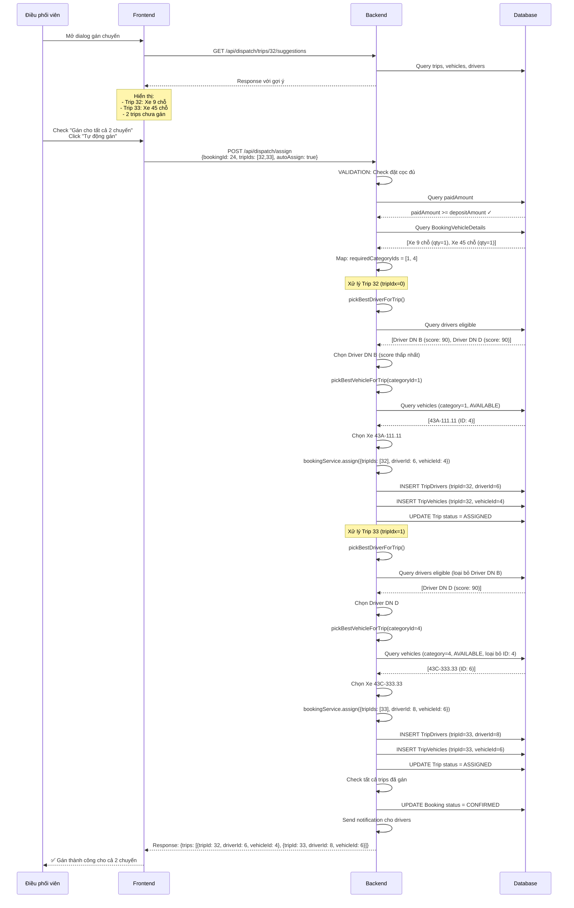
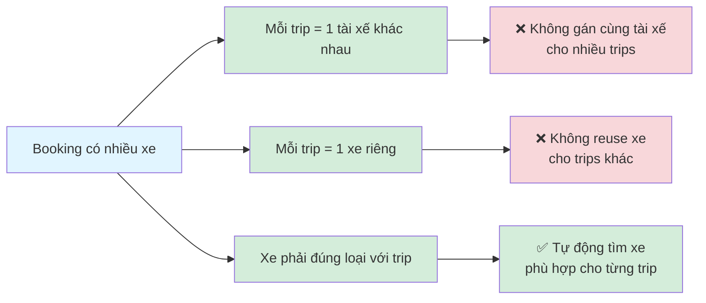

# Workflow Gán Tài Xế và Xe - Booking Có Nhiều Xe

## Sơ đồ Mermaid

```mermaid
flowchart TD
    Start([Bắt đầu: Gán tài xế/xe cho booking có nhiều xe]) --> CheckDeposit{Check đặt cọc đủ?}
    
    CheckDeposit -->|paidAmount < depositAmount| Reject1[❌ REJECT: Khách hàng chưa đặt cọc đủ]
    CheckDeposit -->|paidAmount >= depositAmount| GetTrips[Lấy danh sách trips cần gán]
    
    GetTrips --> MapCategories[Map loại xe cho từng trip<br/>requiredCategoryIds = [category1, category2, ...]]
    
    MapCategories --> CheckMode{Loại gán?}
    
    %% MANUAL ASSIGN BRANCH
    CheckMode -->|Manual Assign| ManualDriver{Has driverId?}
    
    ManualDriver -->|Có| ValidateDriver1[VALIDATION: Check tài xế]
    ValidateDriver1 --> CheckDriverConflict{Tài xế đã gán<br/>cho trip khác?}
    
    CheckDriverConflict -->|Có| Reject2[❌ REJECT: Tài xế đã được gán cho chuyến khác]
    CheckDriverConflict -->|Không| CheckMultipleTrips{targetTripIds.size > 1?}
    
    CheckMultipleTrips -->|Có| Reject3[❌ REJECT: Không thể gán cùng tài xế<br/>cho nhiều chuyến]
    CheckMultipleTrips -->|Không| AssignDriver1[Gán tài xế cho trip]
    
    ManualDriver -->|Không| AutoSelectDriver[Tự động chọn tài xế<br/>pickBestDriverForTrip]
    
    AssignDriver1 --> ManualVehicle{Has vehicleId?}
    AutoSelectDriver --> ManualVehicle
    
    ManualVehicle -->|Có| ValidateVehicle1[VALIDATION: Xe AVAILABLE?]
    ValidateVehicle1 -->|Không| Reject4[❌ REJECT: Xe không sẵn sàng]
    ValidateVehicle1 -->|Có| ValidateVehicle2[VALIDATION: Xe đúng loại?]
    
    ValidateVehicle2 -->|Không| Reject5[❌ REJECT: Xe không đúng loại]
    ValidateVehicle2 -->|Có| ValidateVehicle3[VALIDATION: Xe không conflict?]
    
    ValidateVehicle3 -->|Có conflict| Reject6[❌ REJECT: Xe đã được gán cho chuyến khác]
    ValidateVehicle3 -->|Không conflict| CheckMultipleTrips2{targetTripIds.size > 1?}
    
    CheckMultipleTrips2 -->|Có| FindMoreVehicles[Tìm xe cho trips còn lại<br/>tripIdx = 1, 2, ...]
    CheckMultipleTrips2 -->|Không| AssignVehicle1[Gán xe cho trip]
    
    FindMoreVehicles --> MapCategoryForTrip[Map categoryId cho trip này<br/>requiredCategoryId = requiredCategoryIds[tripIdx]]
    
    MapCategoryForTrip --> FindVehicle[Tìm xe phù hợp:<br/>- Cùng branch<br/>- AVAILABLE<br/>- Đúng category<br/>- Chưa gán cho trips trước<br/>- Không conflict]
    
    FindVehicle --> VehicleFound{Xe tìm được?}
    VehicleFound -->|Không| Reject7[❌ REJECT: Không tìm được xe phù hợp]
    VehicleFound -->|Có| AddToAssigned[Thêm vào assignedVehicles]
    
    AddToAssigned --> MoreTrips{Còn trips?}
    MoreTrips -->|Có| FindMoreVehicles
    MoreTrips -->|Không| AssignAllVehicles[Gán tất cả xe cho trips]
    
    AssignVehicle1 --> AssignAllVehicles
    AssignAllVehicles --> SaveAssignments[Lưu TripDrivers và TripVehicles]
    
    %% AUTO ASSIGN BRANCH
    CheckMode -->|Auto Assign| AutoAssignLoop[Vòng lặp: Với mỗi trip<br/>tripIdx = 0, 1, 2...]
    
    AutoAssignLoop --> AutoSelectDriver2{Tự động chọn tài xế}
    AutoSelectDriver2 --> FilterDrivers[Filter tài xế eligible:<br/>- Cùng branch<br/>- Không nghỉ phép<br/>- Bằng lái còn hạn<br/>- Hạng bằng phù hợp<br/>- Không trùng giờ<br/>- Chưa gán cho trips khác]
    
    FilterDrivers --> CalculateScore[Tính fairness score:<br/>tripsToday*40 + tripsThisWeek*30 + recent*30]
    CalculateScore --> PickBestDriver[Chọn tài xế có score thấp nhất]
    
    PickBestDriver --> AutoSelectVehicle{Tự động chọn xe}
    AutoSelectVehicle --> MapCategoryAuto[Map categoryId cho trip này<br/>requiredCategoryId = requiredCategoryIds[tripIdx]]
    
    MapCategoryAuto --> FilterVehicles[Filter xe eligible:<br/>- Cùng branch<br/>- AVAILABLE<br/>- Đúng category<br/>- Chưa gán cho trips khác<br/>- Không conflict]
    
    FilterVehicles --> PickBestVehicle2[Chọn xe đầu tiên phù hợp]
    
    PickBestVehicle2 --> AssignTrip[Gán cho trip này:<br/>bookingService.assign<br/>tripIds=[tripId]<br/>driverId, vehicleId]
    
    AssignTrip --> TrackVehicle[Track xe đã gán<br/>vehicleToTrips]
    
    TrackVehicle --> MoreTripsAuto{Còn trips?}
    MoreTripsAuto -->|Có| AutoAssignLoop
    MoreTripsAuto -->|Không| SaveAssignments
    
    %% POST ASSIGNMENT
    SaveAssignments --> CheckAllAssigned{Tất cả trips<br/>đã gán?}
    
    CheckAllAssigned -->|Có| UpdateBookingStatus[Update booking status<br/>→ CONFIRMED]
    CheckAllAssigned -->|Không| SendNotification
    
    UpdateBookingStatus --> SendNotification[Send notification<br/>cho các tài xế]
    
    SendNotification --> Success([✅ Thành công])
    
    Reject1 --> End([Kết thúc])
    Reject2 --> End
    Reject3 --> End
    Reject4 --> End
    Reject5 --> End
    Reject6 --> End
    Reject7 --> End
    
    style Start fill:#e1f5ff
    style Success fill:#d4edda
    style Reject1 fill:#f8d7da
    style Reject2 fill:#f8d7da
    style Reject3 fill:#f8d7da
    style Reject4 fill:#f8d7da
    style Reject5 fill:#f8d7da
    style Reject6 fill:#f8d7da
    style Reject7 fill:#f8d7da
    style End fill:#f8d7da
    style CheckDeposit fill:#fff3cd
    style CheckMode fill:#fff3cd
    style ManualDriver fill:#fff3cd
    style AutoSelectDriver fill:#cfe2ff
    style AutoSelectVehicle fill:#cfe2ff
```

## Ví dụ cụ thể: Booking có 2 xe



## Quy tắc quan trọng



